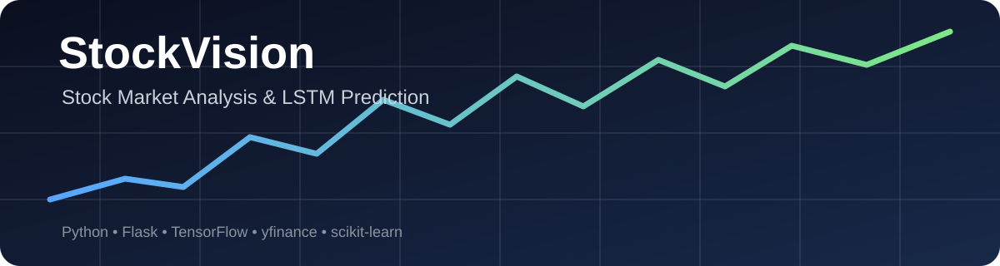

<div align="center">

# 📈 StockVision

### Stock Market Analysis & LSTM-Based Price Prediction

A Python + Flask web application that fetches market data with **yfinance** and uses a trained **TensorFlow LSTM model** to generate 30-day stock-price predictions.

<p>
  
  
  
  
  
</p>

</div>



---

## 🚀 About the Project

**StockVision** is a machine-learning project for experimenting with historical stock-market data and sequence-based price prediction.

The application:

- Fetches recent stock closing-price data using **yfinance**
- Normalizes data with **MinMaxScaler**
- Uses the previous **60 days** as the model input sequence
- Generates predictions for the next **30 days**
- Provides a Flask API endpoint for predictions
- Includes user registration, login, session handling, and protected application routes
- Loads a pre-trained TensorFlow/Keras LSTM model from `lstm_model.keras`

> ⚠️ **Educational project:** StockVision is intended for learning and experimentation. Predictions are not financial advice and should not be used as the sole basis for investment decisions.

---

## ✨ Key Features

| Feature | Description |
|---|---|
| 📊 Market Data | Retrieves historical stock data through yfinance |
| 🧠 LSTM Prediction | Uses a trained recurrent neural network for sequence prediction |
| 🔮 30-Day Forecast | Produces date-wise predicted prices for the next 30 days |
| 🔐 Authentication | Registration, password hashing, login and session-based access |
| 🌐 Flask API | POST `/predict` endpoint for stock predictions |
| 📉 Data Scaling | MinMaxScaler transforms price data before prediction |
| 💾 Saved Model | Pre-trained model stored as `lstm_model.keras` |

---

## 🧠 Machine Learning Workflow

```text
Historical Stock Data
        ↓
     yfinance
        ↓
   Closing Prices
        ↓
   MinMax Scaling
        ↓
Last 60 Days Sequence
        ↓
  TensorFlow LSTM
        ↓
 Next 30 Predictions
        ↓
Date-wise Stock Forecast
```

### Model Architecture

The training script uses:

- LSTM layer — 50 units
- LSTM layer — 50 units
- Dense layer — 25 units
- Output layer — 30 values
- Optimizer — Adam
- Loss — Mean Squared Error

The default training example in `train.py` uses **AAPL** historical data with a 5-year period.

---

## 🛠️ Tech Stack

### Programming
- Python

### Web Development
- Flask
- HTML / CSS / JavaScript

### Machine Learning
- TensorFlow / Keras
- Scikit-learn
- NumPy
- Pandas

### Market Data
- yfinance

### Tools
- Git
- GitHub
- VS Code

---

## 📁 Project Structure

```text
StockVision/
│
├── assets/
│   └── stockvision-banner.svg
│
├── app.py                 # Flask application and prediction API
├── train.py               # LSTM training pipeline
├── lstm_model.keras       # Pre-trained TensorFlow model
├── symbols_valid_meta.csv # Stock symbol metadata
├── requirements.txt       # Python dependencies
└── README.md              # Project documentation
```

---

## ⚙️ Installation

### 1. Clone the repository

```bash
git clone https://github.com/vignesh-c204/StockVision.git
cd StockVision
```

### 2. Create a virtual environment

```bash
python -m venv venv
```

### 3. Activate the environment

**Windows**

```bash
venv\Scripts\activate
```

**macOS / Linux**

```bash
source venv/bin/activate
```

### 4. Install dependencies

```bash
pip install -r requirements.txt
```

---

## ▶️ Run the Application

Start the Flask application:

```bash
python app.py
```

Then open the local Flask address shown in your terminal.

### Prediction API

Send a POST request to:

```text
/predict
```

Example JSON:

```json
{
  "stockSymbol": "AAPL"
}
```

The API returns date-wise predicted prices when valid market data is available.

---

## 🏋️ Train the Model

To retrain the LSTM model:

```bash
python train.py
```

The script downloads historical data, prepares 60-day sequences, trains the LSTM model, and saves the resulting model as:

```text
lstm_model.keras
```

---

## 🔒 Security Note

Before deploying this application publicly, configure the Flask secret key through an environment variable rather than keeping a secret directly in source code.

For production use, authentication storage should also use a persistent database instead of in-memory user storage.

---

## 📚 What I Learned

- Python application development
- Flask routing and REST APIs
- User authentication and password hashing
- Financial time-series data handling
- Data preprocessing with NumPy and Pandas
- LSTM sequence modeling with TensorFlow
- Model saving and loading
- Git and GitHub project documentation

---

## 👨‍💻 Author

**Vignesh C**

MCA Graduate | Full Stack Developer | Python & Django

GitHub: [@vignesh-c204](https://github.com/vignesh-c204)

---

<div align="center">

### ⭐ If you find this project useful, consider giving it a star!

**Built with Python, Flask & TensorFlow**

</div>